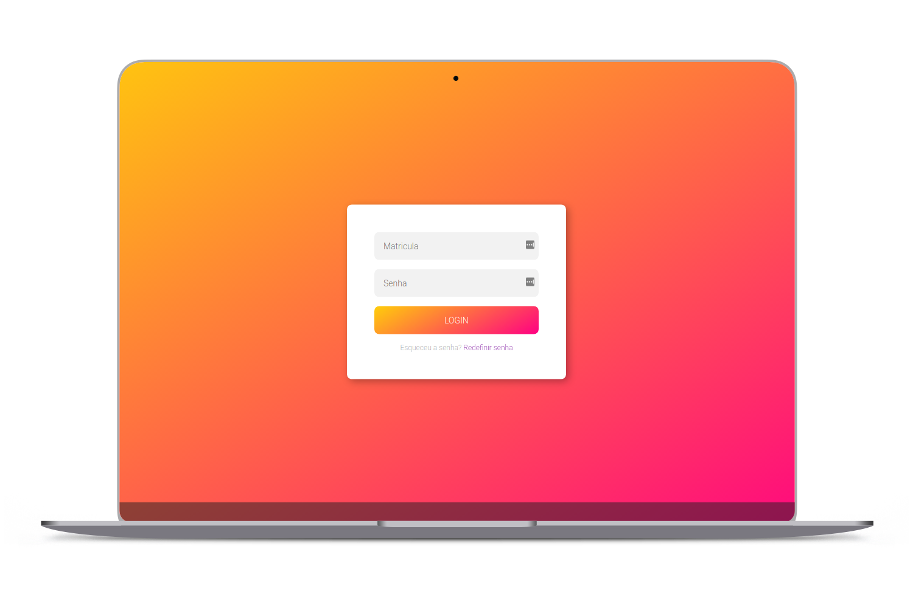
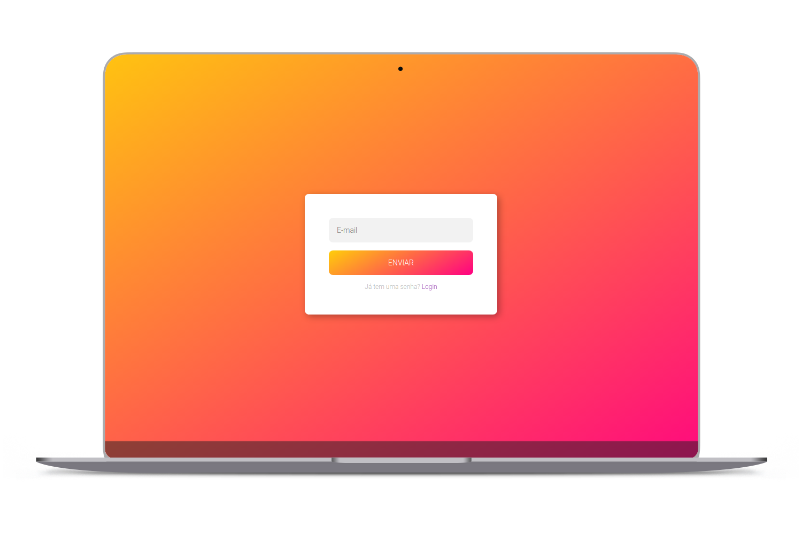

 
  Formulário de login utilizado no projeto <b>Chatbot Bibi</b> da 
  <a href="http://www.amelhorfaculdadedomaranhao.com.br">Faculdade Internacional de São luís - ISL Wyden </a>  

  

  
  
  

 
  <a href="https://bibi-login.herokuapp.com">
    
       
    
  </a>  

## 🚀 Tecnologias 

[NodeJS](https://nodejs.org/en/)

## 🎯 Deploy 

[Heroku](https://www.heroku.com)

## :memo: Licença

Projeto sob licença MIT. Visualizar arquivo [LICENSE](LICENSE.md) para mais informações.

 
by 😎 AntonioNarcilio
